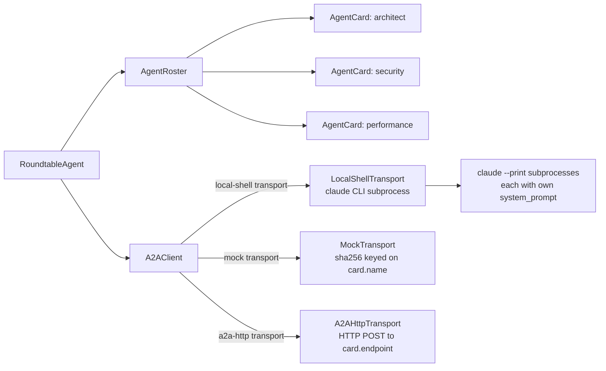

# Architecture Reference

autodev is a multi-CLI software factory built on CrewAI agents, with a strict
layered architecture: every CLI invocation passes through one `ExecutorRouter`,
every stage writes JSON to disk, and every release decision is evidence-based.

---

## High-level flow

```
Input (Brief / PRD / Issue / Bug description)
    │
    ▼
[schemas.py] — Pydantic models for every object in the system
    │
    ▼
[InputClassifierAgent] — decides: Issue Mode or Project Delivery Mode
    │
    ├─ Issue Mode ─────────────────────────────────────────────────────┐
    │      [RequirementAnalystAgent] → [RepoExplorerAgent]            │
    │                                                                  │
    └─ Project Delivery Mode ──────────────────────────────────────────┤
           [ProductManagerAgent] → [RequirementAnalystAgent]          │
               → [PRDWriterAgent] → [RepoExplorerAgent]               │
                                                                      │
                          [SystemArchitectAgent]                      │
                                  │                                   │
                          [MilestonePlannerAgent]                     │
                                  │                                   │
                          [TaskDecomposerAgent]                       │
                                  │                                   │
                          [ScaffolderAgent]                           │
                                  │                                   │
                          ┌───────▼───────┐                           │
                          │ ExecutorRouter │ ◄────────────────────────┘
                          └───────┬───────┘
                      ┌──────────┼──────────┐
                      ▼          ▼           ▼
              [CodexCLI]  [ClaudeCode]  [MockExecutor]
                      └──────────┬──────────┘
                                 ▼
                         [QualityGateAgent]
                                 │
                         [SecurityReviewerAgent]
                                 │
                         [CodeReviewerAgent]
                                 │
                         [IntegrationReviewerAgent]
                                 │
                         [VerifierAgent]
                                 │
                         [DocWriterAgent]
                                 │
                         [ReleaseManagerAgent]
                                 │
                         [CommitAgent]
                                 │
                         Audit artifacts on disk
```

---

## Source layout

```
src/autodev/
├── cli.py               — Typer CLI entrypoint (all subcommands)
├── config.py            — FactoryConfig + executor configs
├── schemas.py           — Pydantic models for all inter-layer objects
├── state.py             — RunState (disk-serialised pipeline state)
├── agents/              — CrewAI agent classes
├── tasks/               — CrewAI Task wrappers
├── flows/               — Top-level flow orchestrations
├── planners/            — Project / milestone / task / dependency planners
├── executors/           — ONLY place CLIs are invoked
├── gates/               — Quality, security, and release gates
├── scanners/            — Read-only repo introspection
├── reports/             — Markdown report generators
├── adapters/            — git, github, A2A, filesystem adapters
├── context_providers/   — Context enrichment for agents
├── mcp_server/          — MCP server (JSON-RPC 2.0 over stdio)
├── templates/           — Jinja2 / string templates
└── utils/               — fs, json_io, slug, logging, concurrency, hashing
```

---

## Layer descriptions

### `schemas.py` — The contract layer

All inter-layer communication uses Pydantic models. No layer passes raw dicts.
Key types:

| Type | Description |
|------|-------------|
| `AgentCard` | Agent identity: name, transport, endpoint, skills |
| `DeliveryTask` | Unit of work: task_type, risk_level, files_affected |
| `ExecutionBackend` | Enum: `codex \| claude_code \| auto` |
| `PipelineMode` | Enum: `dry-run \| apply` |
| `RunState` | Full mutable pipeline state → `run_state.json` |
| `ReleaseCheck` | `ReleaseReady \| NotReleaseReady \| Blocked` |
| `A2ATask` / `A2AMessage` | Agent-to-Agent protocol objects |

### `planners/` — Decomposition

Convert a PRD or issue into milestones, then milestones into tasks.

| Module | Input | Output |
|--------|-------|--------|
| `ProjectPlanner` | PRD | `Milestone[]` |
| `MilestonePlanner` | Milestone | `DeliveryTask[]` |
| `TaskPlanner` | DeliveryTask | `SubTask[]` |
| `DependencyPlanner` | Tasks | Topologically ordered list |

### `executors/` — The only place CLIs are called

All execution is gated through `ExecutorRouter`. Direct CLI invocations
anywhere else in the codebase are a bug.

```
src/autodev/executors/
├── executor_router.py      — picks backend per task, records decision
├── codex_cli_executor.py   — runs: codex exec --skip-git-repo-check {prompt}
├── claude_code_executor.py — runs: claude --print {prompt}
├── mock_codex_executor.py  — deterministic stub; sets mock_used=true
├── mock_claude_executor.py — deterministic stub; sets mock_used=true
├── sandboxed_executor.py   — wraps any executor in an OS-level sandbox
├── shell_executor.py       — allowlist-only shell; rejects dangerous patterns
└── patch_executor.py       — applies search-replace patches from output
```

Shell patterns always blocked regardless of mode:
`rm -rf`, `sudo`, `chmod 777`, `cat .env`, `source .env`,
`printenv`, `curl | bash`, `wget | bash`.

### `gates/` — Quality enforcement

Gates read artifacts and return pass/fail — they never modify code.

- `QualityGate` — test pass rate, lint status, coverage threshold
- `SecurityGate` — high/critical findings in `security_review.json`
- `ReleaseGate` — blocks release if any gate failed, mock was used, or mode
  is `dry-run`

### `agents/` — CrewAI agents

Each agent exposes:
1. `crewai_agent()` — returns a `crewai.Agent` for live orchestration
2. `run(input)` / `review(input)` — deterministic path for testing

Key agents:

| Agent | Role |
|-------|------|
| `InputClassifierAgent` | Route to Issue Mode or Project Delivery Mode |
| `ProductManagerAgent` | Brief → structured product spec |
| `PRDWriterAgent` | Product spec → full PRD document |
| `SystemArchitectAgent` | PRD → architecture + module map |
| `MilestonePlannerAgent` | Architecture → milestone plan |
| `RepoExplorerAgent` | Static repo scan for context |
| `RoundtableAgent` | BMAD party-mode A2A discussion |
| `NextStepAdvisor` | Suggest next CLI command from run state |
| `DocWriterAgent` | README, usage guide, release notes |
| `ReleaseManagerAgent` | Roll up evidence → release check |

### `flows/` — Top-level orchestrations

| Flow | Invoked by |
|------|-----------|
| `IssuePipelineFlow` | `autodev run-issue` |
| `ProjectDeliveryFlow` | `autodev deliver-project` |
| `MilestoneFlow` | `autodev execute-milestone` |
| `BugFixFlow` | `autodev fix-bug` |
| `MultiPatchFlow` | `autodev multi-patch-fix-bug` |
| `SprintFlow` | `autodev sprint-start/status/retro/correct` |
| `ReleaseFlow` | `autodev release-check` |
| `UXDesignFlow` | `autodev design-ux` |
| `InvestigationFlow` | `autodev investigate` |
| `BrownfieldDocFlow` | `autodev document-project` |

### `adapters/` — External integrations

- `adapters/git/` — commit, push, tag, branch
- `adapters/github/` — PR creation via `gh` CLI
- `adapters/a2a/` — A2A HTTP transport and server
- `adapters/a2a/transports/http.py` — `A2AHttpTransport` (send/discover)
- `adapters/a2a/server.py` — `A2AHttpServer` (serve tasks over HTTP)

### `state.py` — Run state and replay

`RunState` is serialised as
`<repo>/.dev-factory/runs/<run_id>/run_state.json` after every stage.
`RunState.load(repo, run_id)` rehydrates from disk, enabling:

- `autodev continue-run` — resume after any failure
- `autodev replay` — re-run from a checkpoint
- `autodev execute-milestone` — run a single milestone from a completed plan

---

## Audit trail layout

```
<repo>/.dev-factory/runs/<run_id>/
├── input/           classification.json, raw_input.md
├── product/         product_brief.json, prd.md, prd.json
├── architecture/    architecture.md, module_map.json, api_contract.json
├── planning/        milestones.json, tasks.json, delivery_plan.md
├── execution/       executor_selection_*.json, execution_calls.jsonl,
│                    codex_calls.jsonl, claude_code_calls.jsonl,
│                    milestone_*_results.json
├── quality/         quality_gate.json, security_review.json,
│                    code_review.json, integration_review.json
├── verification/    verification_report.json, release_check.json
├── delivery/        README.generated.md, usage.generated.md,
│                    release_notes.md, delivery_report.md, final_report.md
└── run_state.json
```

---

## Failure policy

| Situation | Behaviour |
|-----------|-----------|
| `dry-run` + `mock_used=true` | `release_check = NotReleaseReady` |
| Quality gate fails | `release_check = NotReleaseReady` |
| Security gate has critical finding | `release_check = Blocked` |
| CLI missing + `allow_mock=false` | Task: `cli_missing_fail_closed` |
| `final_report.md` generation | Never relabels `failed`/`skipped` as `passed` |

---

## A2A integration

`RoundtableAgent` dispatches parallel tasks to agent cards over A2A. Each
participant runs in its own subprocess (or mock) with a distinct `system_prompt`.



`MockTransport` keys its deterministic response on `sha256(prompt + card_name)` —
different cards give different mock answers on the same prompt, preventing
roleplay convergence.

---

## MCP server

`autodev mcp-serve` exposes the pipeline commands as a JSON-RPC 2.0 stdio
server conforming to the Model Context Protocol. `MCPServer` in
`src/autodev/mcp_server/server.py` translates tool calls to flow invocations.

See [Tutorial 06 — MCP server](tutorials/06-mcp-server.md).

---

## Security boundaries

The following security controls are enforced at the implementation layer.
They are documented here as authoritative reference; the CHANGELOG (0.1.0a2)
records the release they were introduced.

| Boundary | Implementation | Description |
|----------|---------------|-------------|
| **SSRF defense (A2A)** | `adapters/a2a/server.py` — `_validate_url()` | Outgoing A2A HTTP calls block RFC-1918 and loopback addresses by default. Override only in test environments via `AUTODEV_A2A_ALLOW_PRIVATE_NETWORKS=1`. Never set in production. |
| **Path safety (MCP)** | `mcp_server/path_safety.py` | MCP tool calls that specify `repo_path` are validated against an allowlist of safe path prefixes. Absolute paths pointing outside allowed roots are rejected before any flow executes. |
| **Branch-name injection rejection** | `executors/worker_isolator.py` | Branch names used in executor invocations are validated against 11 rejection patterns (shell metacharacters, path traversal, Unicode overrides). Invalid names are rejected with a structured error before any subprocess is spawned. |
| **Secret redaction in logs** | `utils/secret_redaction.py` | Log output from all executor invocations and agent runs passes through a redaction filter that replaces API keys, tokens, and password patterns with `[REDACTED]` before writing to disk or stderr. |
| **Apply-mode double gate (MCP)** | `mcp_server/server.py` | MCP `mode=apply` requires **both** the request body `allow_apply=true` **and** the server environment variable `AUTODEV_MCP_ALLOW_APPLY=1`. Either condition alone is insufficient; both must be satisfied. |

---

## Related docs

- [Quickstart](quickstart.md)
- [Tutorial 03 — Multi-CLI routing](tutorials/03-multi-cli-routing.md)
- [Tutorial 07 — A2A server](tutorials/07-a2a-server.md)
- [FAQ](faq.md)
