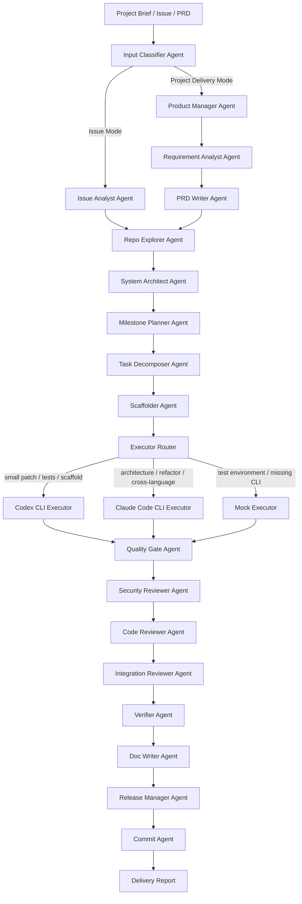

# Architecture

`crewai-multicli-software-factory` orchestrates CrewAI agents over a
multi-CLI executor router (Codex CLI + Claude Code CLI + mocks) to deliver
either a single-issue change or a full project from brief/PRD.

## Top-level flow

## Layers

- `schemas.py` — pydantic models that every other layer reads/writes.
- `executors/` — only place where Codex / Claude CLIs are invoked.
- `scanners/` — read-only repo introspection.
- `gates/` — language and release quality gates.
- `agents/` — CrewAI agents, each with a `.crewai_agent()` and a deterministic
  `.run(…)` / `.review(…)` method.
- `tasks/` — CrewAI `Task` wrappers bound to each agent.
- `flows/` — top-level orchestrations (Issue Mode + Project Delivery Mode +
  single-milestone + release-only).
- `planners/` — project / milestone / task / dependency planners.
- `reports/` — markdown reporters for delivery + release + final report.
- `adapters/` — git / github / filesystem adapters.
- `utils/` — fs, json io, slug, logging, concurrency, command_safety, hashing.

## State & replay

A run owns `<repo>/.dev-factory/runs/<run_id>/`. Every transition writes a
JSON or JSONL record; `RunState.load(...)` rehydrates the run from disk so
`replay`, `continue-run`, and `execute-milestone` can resume work.

## Failure policy

- `dry-run` + `mock_used` ⇒ release_check returns `NotReleaseReady`.
- a failed quality gate ⇒ release_check returns `NotReleaseReady`.
- a failed security review ⇒ release_check returns `Blocked`.
- missing CLI when `allow_mock_executor=false` ⇒ executor returns
  `error_type=cli_missing_fail_closed`, run continues but the failure is
  recorded.
