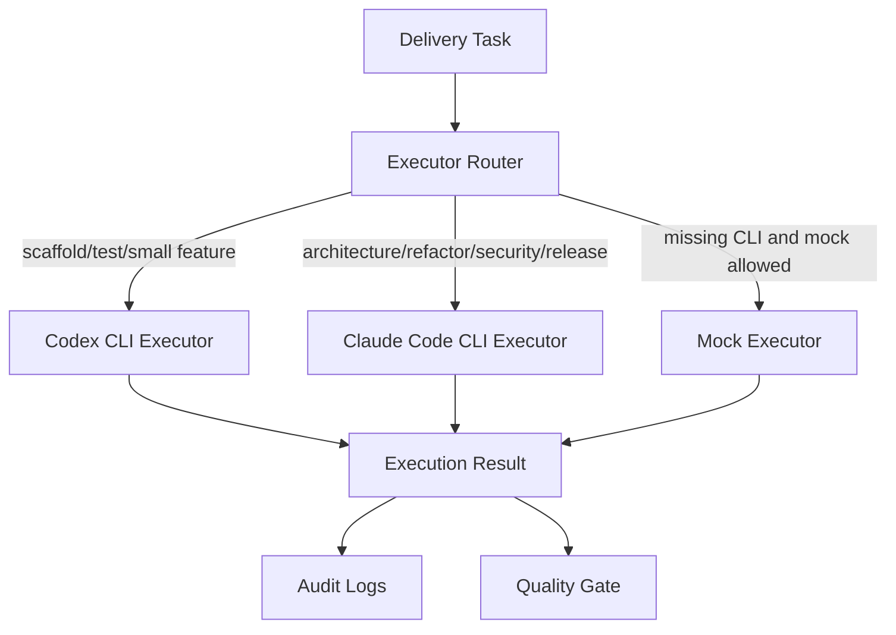

# Multi-CLI Executor Router



## Why two CLIs

- **Codex CLI** is great at small mechanical writes: scaffolds, test
  additions, lint fixes, single-file patches.
- **Claude Code CLI** is preferred for long-context work: architecture
  decisions, multi-file refactors, cross-language integration, security
  review, release roll-up, documentation tone.

## Routing rules (default policy)

| When                                               | Backend                    |
|----------------------------------------------------|----------------------------|
| `--executor codex` (explicit)                      | Codex                      |
| `--executor claude-code` (explicit)                | Claude Code                |
| `task_type == scaffold`                            | Codex                      |
| `task_type == test`                                | Codex                      |
| `task_type == feature` and ≤5 files and low/medium risk | Codex                 |
| `task_type == feature` otherwise                   | Claude Code                |
| `task_type == refactor`                            | Claude Code                |
| `task_type == architecture`                        | Claude Code                |
| `task_type == integration` AND cross-language      | Claude Code                |
| `task_type == integration` AND single-language     | Codex                      |
| `task_type == security`                            | Claude Code                |
| `task_type == docs`                                | Claude Code                |
| `task_type == release`                             | Claude Code                |

`max_files_for_codex` and `max_risk_for_codex` are tunable on
`ExecutorSelectionPolicy`.

## Fall-back semantics

1. If the preferred real CLI is installed → use it (`fallback_used=False`).
2. If the preferred real CLI is missing AND `allow_mock=True` → use the
   matching mock executor and set `fallback_used=True`, `mock_used=True`.
3. If the preferred real CLI is missing AND `allow_mock=False` → return
   `ExecutionResult(error_type="cli_missing_fail_closed")` and the
   ReleaseGate will refuse `ReleaseReady`.

## Audit log fields

Each call appends a record to:

- `execution/execution_calls.jsonl`
- `execution/codex_calls.jsonl` (Codex or MockCodex)
- `execution/claude_code_calls.jsonl` (Claude or MockClaude)
- `execution/executor_selection_<task_id>.json` (router decision)

Fields include `backend`, `selected_backend_reason`, `fallback_used`,
`mock_used`, `command`, `exit_code`, `duration_ms`, `safety_flags`.

## Example decision

```json
{
  "task_id": "M2-T4",
  "task_type": "refactor",
  "risk_level": "high",
  "language": "typescript",
  "candidate_backends": ["codex", "claude_code"],
  "selected_backend": "claude_code",
  "reason": "High-risk refactor with multiple target files should use Claude Code CLI for stronger long-context reasoning.",
  "fallback_used": false,
  "mock_used": false
}
```

## Codex CLI configuration

`CodexCliExecutorConfig` exposes:

- `binary` (default `codex`)
- `command_template` (default `codex exec --skip-git-repo-check {prompt}`)
- `timeout_seconds`
- `allow_mock_fallback`

Environment overrides: `FACTORY_CODEX_BIN`, `FACTORY_CODEX_CMD`.

## Claude Code CLI configuration

`ClaudeCodeExecutorConfig`:

- `binary` (default `claude`)
- `command_template` (default `claude --print {prompt}`)
- `timeout_seconds`
- `allowed_tools` (`Read`, `Edit`, `Write`, `Bash`)
- `disallowed_patterns` (deny list checked against the prompt before invoke)

Environment overrides: `FACTORY_CLAUDE_BIN`, `FACTORY_CLAUDE_CMD`.

Versions of Claude Code that don't support a given flag surface as
`error_type=unsupported_cli_args` instead of crashing.
