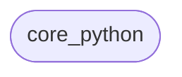

# Architecture: Add JSON output to the CLI

Architecture for Add JSON output to the CLI targeting languages: python.

## Modules
- **core_python** (python): Core domain for python; depends_on=[]

## Dependency Graph

## Decisions
- Use multi-language layout per detected language; integration module bridges them.
- All cross-language schema work routes to Claude Code; small patches to Codex.
